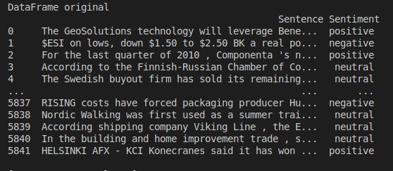
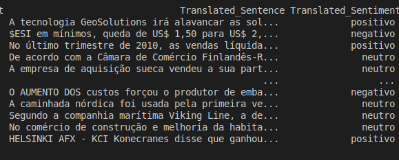

# Tradução de Análise de Sentimentos

## Visão Geral

Este projeto traduz dados de análise de sentimentos do inglês para o português utilizando a API do Google Translate. O conjunto de dados original contém frases e seus sentimentos correspondentes, que são traduzidos e salvos em novos arquivos CSV.

## Requisitos

- Python 3.x
- pandas
- googletrans

Você pode instalar os pacotes necessários usando o pip:

```bash
pip install pandas googletrans
```

Uso
```bash
python3 sentiment_analysis.csv
```

Sentence: A frase a ser traduzida.<br>
Sentiment: O sentimento associado à frase.<br>
<br>
Entrada:<br>

<br>
Saída:<br>

